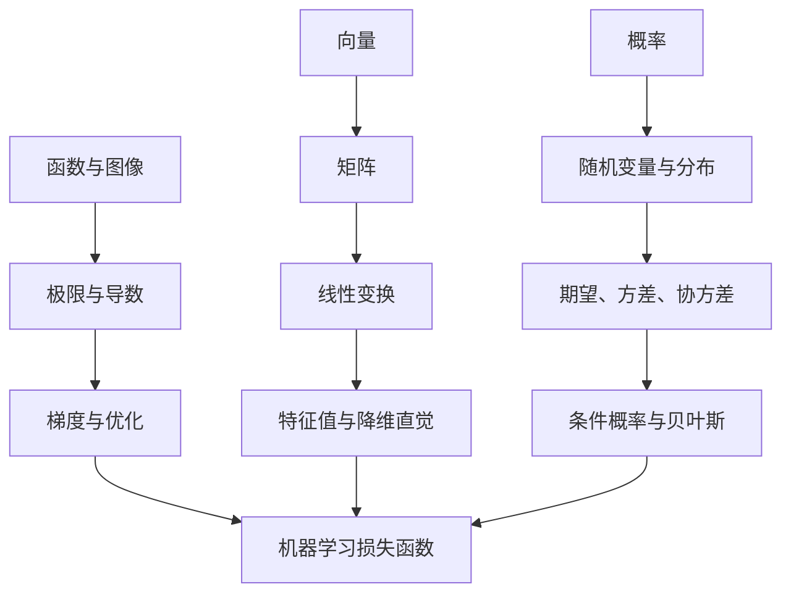

# 00 分析、代数与概率统计基础

这一章的目标不是把数学学成纯理论课，而是建立机器学习够用的数学直觉。学习时建议始终把公式、图像和代码连在一起：看到公式时能画出来，看到图像时能写出代码，看到代码结果时能解释背后的数学含义。

## 1. 本章学习目标

学完这一章后，应该能做到：

1. 理解函数、极限、导数、梯度和优化之间的关系。
2. 能用向量、矩阵表达数据、参数和模型。
3. 能理解概率、随机变量、分布、期望、方差和条件概率。
4. 能看懂常见损失函数和评估指标的数学含义。
5. 能用 Python 画出函数曲线、概率分布、向量变换和简单优化过程。

## 2. 学习路线



## 3. 分析基础

分析部分主要服务于“模型如何学习”。机器学习里的训练，本质上经常是在最小化一个损失函数。

### 3.1 函数与图像

要掌握：

- 一元函数和多元函数。
- 函数图像。
- 单调性。
- 最大值和最小值。
- 凸函数的直觉。

机器学习对应关系：

- 模型可以看成函数。
- 参数变化会改变函数形状。
- 损失函数也是函数。

可视化练习：

```python
import numpy as np
import matplotlib.pyplot as plt

x = np.linspace(-5, 5, 200)

plt.plot(x, x ** 2, label="x^2")
plt.plot(x, np.sin(x), label="sin(x)")
plt.plot(x, 1 / (1 + np.exp(-x)), label="sigmoid")

plt.legend()
plt.grid(True)
plt.title("Common Function Shapes")
plt.show()
```

### 3.2 极限与连续

要掌握：

- 极限描述“无限接近”。
- 连续意味着函数图像没有断裂。
- 很多优化算法默认函数足够平滑。

机器学习对应关系：

- 梯度下降依赖局部变化趋势。
- 损失函数越平滑，优化通常越稳定。

### 3.3 导数

导数描述函数在某一点的变化速度。

要掌握：

- 导数的几何意义：切线斜率。
- 导数的符号：正、负、零。
- 常见函数导数。
- 链式法则。

机器学习对应关系：

- 导数告诉参数应该往哪个方向调整。
- 反向传播大量使用链式法则。

可视化练习：

```python
import numpy as np
import matplotlib.pyplot as plt

x = np.linspace(-3, 3, 200)
y = x ** 2
dy = 2 * x

plt.plot(x, y, label="f(x)=x^2")
plt.plot(x, dy, label="f'(x)=2x")
plt.axhline(0, color="black", linewidth=0.8)
plt.legend()
plt.grid(True)
plt.title("Function and Derivative")
plt.show()
```

### 3.4 偏导数与梯度

多元函数中，每个变量都有自己的变化方向。梯度把这些方向合在一起。

要掌握：

- 偏导数。
- 梯度向量。
- 梯度方向。
- 梯度下降。

机器学习对应关系：

- 模型参数通常不止一个。
- 梯度告诉所有参数应该如何一起更新。

梯度下降公式：

```text
参数 = 参数 - 学习率 * 梯度
```

代码练习：

```python
import numpy as np
import matplotlib.pyplot as plt

def loss(w):
    return (w - 3) ** 2

def grad(w):
    return 2 * (w - 3)

w = -4
lr = 0.1
history = []

for _ in range(40):
    history.append(w)
    w = w - lr * grad(w)

x = np.linspace(-5, 6, 200)
plt.plot(x, loss(x), label="loss")
plt.scatter(history, [loss(v) for v in history], color="red", s=20, label="steps")
plt.legend()
plt.grid(True)
plt.title("Gradient Descent")
plt.show()
```

## 4. 线性代数基础

线性代数主要服务于“如何表达数据和模型”。表格数据、图像、文本 embedding、神经网络权重，本质上都离不开向量和矩阵。

### 4.1 向量

要掌握：

- 向量表示一组数。
- 向量可以表示样本、特征、参数。
- 向量长度。
- 向量加法。
- 点积。
- 余弦相似度。

机器学习对应关系：

- 一个用户可以表示为一个特征向量。
- 一个文本可以表示为一个 embedding 向量。
- 点积常用于相似度、线性模型和注意力机制。

代码练习：

```python
import numpy as np

a = np.array([1, 2])
b = np.array([3, 4])

dot = np.dot(a, b)
cosine = dot / (np.linalg.norm(a) * np.linalg.norm(b))

print("dot:", dot)
print("cosine:", cosine)
```

### 4.2 矩阵

要掌握：

- 矩阵表示二维数据。
- 矩阵乘法。
- 转置。
- 逆矩阵的直觉。
- 秩的直觉。

机器学习对应关系：

- 一个数据集通常可以表示为样本数乘特征数的矩阵。
- 神经网络的一层通常可以表示为矩阵乘法加偏置。

```text
输出 = 输入矩阵 × 权重矩阵 + 偏置
```

### 4.3 线性变换

矩阵不仅是表格，也可以看成对空间的变换。

要掌握：

- 拉伸。
- 旋转。
- 投影。
- 压缩。

机器学习对应关系：

- PCA 是在寻找最重要的投影方向。
- 神经网络中的线性层会把输入映射到新的特征空间。

可视化练习：

```python
import numpy as np
import matplotlib.pyplot as plt

points = np.array([
    [0, 0],
    [1, 0],
    [1, 1],
    [0, 1],
    [0, 0],
])

matrix = np.array([
    [2, 0.5],
    [0, 1],
])

transformed = points @ matrix.T

plt.plot(points[:, 0], points[:, 1], label="original")
plt.plot(transformed[:, 0], transformed[:, 1], label="transformed")
plt.axis("equal")
plt.grid(True)
plt.legend()
plt.title("Linear Transformation")
plt.show()
```

### 4.4 特征值与特征向量

要掌握直觉即可：

- 有些方向经过矩阵变换后，方向不变，只是长度变化。
- 这些方向就是特征向量。
- 长度变化比例就是特征值。

机器学习对应关系：

- PCA 和协方差矩阵有关。
- 降维本质上是在寻找保留信息最多的方向。

## 5. 概率基础

概率主要服务于“不确定性”。分类模型输出概率，生成模型学习分布，评估模型时也常常需要统计思想。

### 5.1 概率与事件

要掌握：

- 样本空间。
- 事件。
- 概率。
- 互斥事件。
- 独立事件。

机器学习对应关系：

- 分类模型输出某个类别的概率。
- 随机抽样会影响训练结果。
- 数据分布决定模型能学到什么。

### 5.2 随机变量与分布

要掌握：

- 离散随机变量。
- 连续随机变量。
- 概率质量函数。
- 概率密度函数。
- 累积分布函数。

常见分布：

- 伯努利分布。
- 二项分布。
- 均匀分布。
- 正态分布。

可视化练习：

```python
import numpy as np
import matplotlib.pyplot as plt

samples = np.random.normal(loc=0, scale=1, size=5000)

plt.hist(samples, bins=50, density=True)
plt.title("Normal Distribution")
plt.grid(True)
plt.show()
```

### 5.3 期望、方差与标准差

要掌握：

- 期望表示平均水平。
- 方差表示波动程度。
- 标准差和原数据单位一致，更容易解释。

机器学习对应关系：

- 标准化会用到均值和标准差。
- 方差过大可能意味着特征尺度不稳定。
- 偏差-方差权衡是理解过拟合的重要入口。

### 5.4 协方差与相关系数

要掌握：

- 协方差描述两个变量是否一起变化。
- 相关系数把协方差标准化到 -1 到 1。
- 相关不等于因果。

机器学习对应关系：

- 特征相关性会影响模型解释。
- 高度相关的特征可能带来冗余。
- PCA 使用协方差矩阵理解数据方向。

可视化练习：

```python
import numpy as np
import seaborn as sns
import matplotlib.pyplot as plt

x = np.random.normal(size=300)
y = 2 * x + np.random.normal(scale=0.5, size=300)

data = np.column_stack([x, y])
corr = np.corrcoef(data.T)

sns.heatmap(corr, annot=True, cmap="coolwarm", vmin=-1, vmax=1)
plt.title("Correlation Matrix")
plt.show()
```

### 5.5 条件概率与贝叶斯公式

要掌握：

- 条件概率。
- 联合概率。
- 边缘概率。
- 贝叶斯公式。

贝叶斯公式：

```text
P(A|B) = P(B|A)P(A) / P(B)
```

机器学习对应关系：

- 朴素贝叶斯分类器。
- 医疗检测中的阳性概率解释。
- 生成模型和概率建模。

## 6. 统计基础

统计部分主要服务于“如何从样本推断总体”，以及“如何判断模型结果是否可靠”。

### 6.1 样本与总体

要掌握：

- 总体。
- 样本。
- 抽样偏差。
- 样本量。

机器学习对应关系：

- 训练集只是总体的一部分。
- 数据采样方式会影响模型表现。
- 测试集必须尽量代表真实使用场景。

### 6.2 估计

要掌握：

- 点估计。
- 区间估计。
- 置信区间。

机器学习对应关系：

- 评估指标不是绝对真理，而是基于样本的估计。
- 小测试集上的 accuracy 可能非常不稳定。

### 6.3 假设检验

要掌握：

- 原假设。
- 备择假设。
- p 值。
- 显著性水平。

机器学习对应关系：

- A/B 测试。
- 判断新模型是否真的优于旧模型。
- 判断指标提升是否可能只是随机波动。

### 6.4 最大似然估计

最大似然估计的直觉是：选择一组参数，让已经观察到的数据出现的可能性最大。

机器学习对应关系：

- 逻辑回归可以从最大似然角度理解。
- 交叉熵损失和概率建模密切相关。
- 很多生成模型都和似然有关。

## 7. 和机器学习模型的对应关系

| 数学知识 | 对应机器学习内容 |
| --- | --- |
| 函数 | 模型、预测函数、损失函数 |
| 导数 | 参数更新方向 |
| 梯度 | 多参数优化 |
| 链式法则 | 反向传播 |
| 向量 | 样本、特征、embedding |
| 矩阵 | 数据集、权重、线性层 |
| 点积 | 线性模型、相似度、attention |
| 特征值和特征向量 | PCA、降维 |
| 概率分布 | 分类概率、生成模型 |
| 期望和方差 | 统计描述、模型稳定性 |
| 条件概率 | 贝叶斯分类、概率推断 |
| 最大似然 | 逻辑回归、生成模型、交叉熵 |

## 8. 建议学习节奏

如果每周投入 6-10 小时，本章建议用 2-3 周完成。

| 周次 | 内容 | 输出 |
| --- | --- | --- |
| 第 1 周 | 函数、导数、梯度下降 | 画出函数曲线和梯度下降过程 |
| 第 2 周 | 向量、矩阵、线性变换、PCA 直觉 | 画出二维线性变换和简单降维图 |
| 第 3 周 | 概率分布、期望方差、条件概率、统计推断 | 画出分布图、相关矩阵和简单 A/B 测试 |

## 9. 本章检查清单

学完后，用下面问题检查自己：

1. 为什么机器学习训练经常可以理解为最小化损失函数？
2. 导数、偏导数、梯度分别是什么？
3. 学习率太大或太小会发生什么？
4. 一个表格数据集如何表示为矩阵？
5. 点积为什么可以衡量相似度？
6. PCA 为什么可以用于降维？
7. 概率和统计的区别是什么？
8. 条件概率为什么容易反直觉？
9. 为什么测试集指标只是对真实效果的估计？
10. 交叉熵和概率建模有什么关系？

## 10. 后续衔接

完成本章后，可以进入机器学习核心框架和监督学习。建议在学习线性回归时回看导数和矩阵，在学习逻辑回归时回看概率和最大似然，在学习 PCA 时回看协方差、特征值和特征向量。
