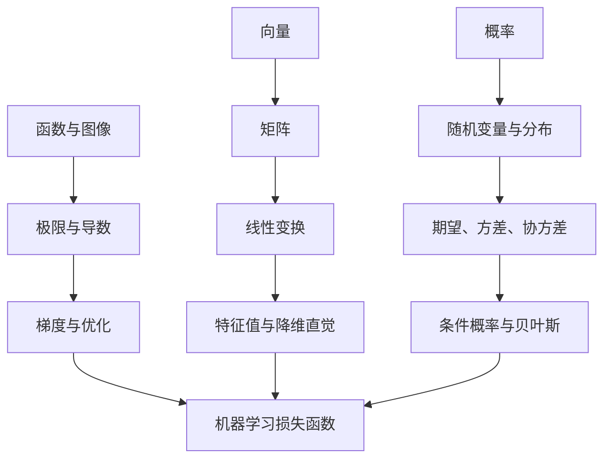

# 00 分析、代数与概率统计基础

这一章的目标不是把数学学成纯理论课，而是建立机器学习够用的数学直觉。学习时建议始终把公式、图像和代码连在一起：看到公式时能画出来，看到图像时能写出代码，看到代码结果时能解释背后的数学含义。

## 1. 本章学习目标

学完这一章后，应该能做到：

1. 理解函数、极限、导数、梯度和优化之间的关系。
2. 能用向量、矩阵表达数据、参数和模型。
3. 能理解概率、随机变量、分布、期望、方差和条件概率。
4. 能看懂常见损失函数和评估指标的数学含义。
5. 能用 Python 画出函数曲线、概率分布、向量变换和简单优化过程。

## 2. 学习路线



## 3. 分析基础

分析部分主要服务于“模型如何学习”。机器学习里的训练，本质上经常是在最小化一个损失函数，而损失函数如何变化、参数应该往哪里改、学习率为什么会影响训练稳定性，都属于分析学要解决的问题。

本节按“函数 -> 极限 -> 连续 -> 导数 -> 泰勒近似 -> 多元函数 -> 梯度下降 -> 凸性”的顺序展开。学习时不要只背定义，应该同时做三件事：画图、代入数值、写代码验证。

### 3.1 函数与图像

函数描述输入和输出之间的对应关系。机器学习中的模型、损失函数、激活函数、概率映射，本质上都可以看成函数。

#### 3.1.1 函数的基本定义

如果对集合 `X` 中的每一个输入 `x`，都能在集合 `Y` 中找到唯一的输出 `y`，就称这是一个从 `X` 到 `Y` 的函数，记作：

```text
f: X -> Y
y = f(x)
```

其中：

- `x` 是自变量，也就是输入。
- `y` 是因变量，也就是输出。
- `X` 是定义域。
- `Y` 是值域所在的集合。

例子：

```text
f(x) = 2x + 1
f(3) = 7
```

机器学习对应关系：

```text
模型: 输入特征 -> 预测结果
损失函数: 模型参数 -> 错误程度
激活函数: 神经元输入 -> 非线性输出
```

#### 3.1.2 一元函数与多元函数

一元函数只有一个输入变量：

```text
f(x) = x^2
```

多元函数有多个输入变量：

```text
f(x, y) = x^2 + y^2
```

机器学习里更常见的是多元函数，因为一个样本通常有多个特征，一个模型通常有多个参数。

例如线性模型：

```text
y_hat = w1 * x1 + w2 * x2 + b
```

这里 `x1` 和 `x2` 是特征，`w1`、`w2` 和 `b` 是模型参数。

#### 3.1.3 常见函数族

学习机器学习前，至少要熟悉这些函数形状：

| 函数 | 形式 | 直觉 | 机器学习用途 |
| --- | --- | --- | --- |
| 线性函数 | `f(x)=ax+b` | 直线关系 | 线性回归、线性分类器 |
| 多项式函数 | `f(x)=x^2, x^3` | 弯曲关系 | 多项式特征、非线性拟合 |
| 指数函数 | `f(x)=e^x` | 快速增长 | softmax、概率模型 |
| 对数函数 | `f(x)=log(x)` | 增长越来越慢 | 交叉熵、似然函数 |
| Sigmoid | `1/(1+e^-x)` | 映射到 0 到 1 | 逻辑回归、二分类概率 |
| ReLU | `max(0,x)` | 负数截断为 0 | 神经网络激活函数 |

#### 3.1.4 函数图像的阅读方法

看函数图像时，至少观察五件事：

1. 输入增大时，输出整体是上升还是下降？
2. 图像有没有拐弯？
3. 有没有最大值或最小值？
4. 有没有不连续或不可导的点？
5. 越靠近某些区域，函数变化是否越来越快？

这些问题会直接影响模型训练。

例如损失函数如果在某个区域很陡，说明参数稍微变化就会导致损失大幅变化；如果很平，说明参数变化对损失影响很小，训练可能变慢。

#### 3.1.5 单调性与极值

如果 `x` 增大时 `f(x)` 也增大，函数在该区间单调递增。如果 `x` 增大时 `f(x)` 减小，函数在该区间单调递减。

极值分为：

- 局部最小值：在附近区域里最小。
- 局部最大值：在附近区域里最大。
- 全局最小值：在整个定义域上最小。
- 全局最大值：在整个定义域上最大。

机器学习训练通常关心全局最小值，但实际优化过程中经常只能找到局部较优的点。

#### 3.1.6 可视化练习

画出常见函数，先形成图像直觉。

```python
import numpy as np
import matplotlib.pyplot as plt

x = np.linspace(-5, 5, 400)

functions = {
    "linear": x,
    "quadratic": x ** 2,
    "sigmoid": 1 / (1 + np.exp(-x)),
    "relu": np.maximum(0, x),
    "tanh": np.tanh(x),
}

for name, y in functions.items():
    plt.plot(x, y, label=name)

plt.axhline(0, color="black", linewidth=0.8)
plt.axvline(0, color="black", linewidth=0.8)
plt.legend()
plt.grid(True)
plt.title("Common Functions in Machine Learning")
plt.show()
```

练习问题：

1. 哪些函数有明显的最小值？
2. Sigmoid 为什么适合表示概率？
3. ReLU 在 `x=0` 处有什么特殊之处？
4. `x^2` 和 `x^4` 都有最小值，它们在 0 附近谁更平？

### 3.2 数列、极限与逼近

极限是分析学的核心语言。导数、连续、积分、优化收敛，都离不开极限。

#### 3.2.1 数列的极限

数列是一串按顺序排列的数：

```text
a1, a2, a3, ...
```

如果随着 `n` 越来越大，`an` 越来越接近某个固定数 `A`，就说数列 `an` 收敛到 `A`：

```text
lim(n -> infinity) an = A
```

例子：

```text
an = 1 / n
1, 1/2, 1/3, 1/4, ...
lim(n -> infinity) 1/n = 0
```

机器学习对应关系：

- 梯度下降希望参数序列逐步接近最优参数。
- 训练损失通常希望随着 epoch 增加逐步收敛。
- 随机采样下的平均值会随着样本数增大接近期望。

#### 3.2.2 函数的极限

函数极限描述的是：当 `x` 接近某个点 `a` 时，`f(x)` 接近什么值。

```text
lim(x -> a) f(x) = L
```

注意：极限关心的是“接近过程”，不一定关心函数在 `a` 点本身是否有定义。

例子：

```text
f(x) = (x^2 - 1) / (x - 1)
```

当 `x != 1` 时：

```text
f(x) = x + 1
```

所以：

```text
lim(x -> 1) f(x) = 2
```

即使原式在 `x=1` 处没有定义，极限依然存在。

#### 3.2.3 左极限与右极限

从左边接近 `a`：

```text
lim(x -> a-) f(x)
```

从右边接近 `a`：

```text
lim(x -> a+) f(x)
```

只有当左右极限都存在且相等时，普通极限才存在。

ReLU 函数：

```text
f(x) = max(0, x)
```

在 `x=0` 处函数连续，但左右导数不同。这会在后面解释。

#### 3.2.4 用代码观察极限

```python
import numpy as np

def f(x):
    return (x ** 2 - 1) / (x - 1)

for x in [0.9, 0.99, 0.999, 1.001, 1.01, 1.1]:
    print(x, f(x))
```

输出会显示，当 `x` 从两侧接近 1 时，函数值接近 2。

### 3.3 连续性

连续的直觉是：函数图像可以一笔画出，中间没有断裂、跳跃或无穷发散。

#### 3.3.1 连续的定义

函数 `f(x)` 在 `x=a` 处连续，需要同时满足：

1. `f(a)` 有定义。
2. `lim(x -> a) f(x)` 存在。
3. `lim(x -> a) f(x) = f(a)`。

这三个条件缺一不可。

#### 3.3.2 常见不连续类型

| 类型 | 直觉 | 例子 |
| --- | --- | --- |
| 可去间断 | 点缺失，但趋势存在 | `(x^2-1)/(x-1)` 在 `x=1` |
| 跳跃间断 | 左右极限不同 | 阶跃函数 |
| 无穷间断 | 趋向无穷 | `1/x` 在 `x=0` |

#### 3.3.3 连续性和机器学习

很多优化算法更喜欢连续、平滑的函数。原因是：

- 连续函数不会突然跳变，优化路径更稳定。
- 平滑函数有稳定的梯度方向。
- 不连续损失通常难以直接用梯度下降优化。

例如分类准确率 accuracy 虽然直观，但它不是一个适合直接优化的连续损失。模型预测概率从 0.49 变成 0.51 时，accuracy 可能突然改变；但交叉熵会连续反映概率变化。

### 3.4 导数与变化率

导数描述函数在某一点附近的瞬时变化率。机器学习中，导数告诉我们参数如何改变才能让损失下降。

#### 3.4.1 平均变化率

从 `x` 到 `x+h`，函数的平均变化率是：

```text
[f(x+h) - f(x)] / h
```

这表示函数值变化量除以输入变化量。

如果 `f(x)=x^2`，从 `x=2` 到 `x=3`：

```text
[f(3)-f(2)] / (3-2) = (9-4)/1 = 5
```

这只是区间上的平均变化率。

#### 3.4.2 瞬时变化率与导数定义

让 `h` 越来越接近 0，就得到瞬时变化率：

```text
f'(x) = lim(h -> 0) [f(x+h) - f(x)] / h
```

这就是导数的定义。

对于 `f(x)=x^2`：

```text
f'(x) = 2x
```

在 `x=3` 处：

```text
f'(3) = 6
```

这表示在 `x=3` 附近，`x` 增加一点点，`f(x)` 大约以 6 倍速度增加。

#### 3.4.3 导数的几何意义

导数是函数图像在某一点处的切线斜率。

- 导数大于 0：函数局部上升。
- 导数小于 0：函数局部下降。
- 导数等于 0：可能是极值点，也可能是平坦点。

#### 3.4.4 常见导数公式

| 函数 | 导数 |
| --- | --- |
| `c` | `0` |
| `x` | `1` |
| `x^n` | `n*x^(n-1)` |
| `e^x` | `e^x` |
| `log(x)` | `1/x` |
| `sin(x)` | `cos(x)` |
| `cos(x)` | `-sin(x)` |
| `1/(1+e^-x)` | `sigmoid(x)*(1-sigmoid(x))` |

#### 3.4.5 导数运算法则

加法：

```text
(f + g)' = f' + g'
```

乘法：

```text
(fg)' = f'g + fg'
```

复合函数链式法则：

```text
[f(g(x))]' = f'(g(x)) * g'(x)
```

链式法则是理解反向传播的核心。

#### 3.4.6 数值导数

在代码中，可以用很小的 `h` 近似导数：

```python
def numerical_derivative(f, x, h=1e-5):
    return (f(x + h) - f(x - h)) / (2 * h)

def f(x):
    return x ** 2

print(numerical_derivative(f, 3.0))
```

结果会接近 `6`。

#### 3.4.7 可视化导数

```python
import numpy as np
import matplotlib.pyplot as plt

x = np.linspace(-3, 3, 200)
y = x ** 2
dy = 2 * x

plt.plot(x, y, label="f(x)=x^2")
plt.plot(x, dy, label="f'(x)=2x")
plt.axhline(0, color="black", linewidth=0.8)
plt.legend()
plt.grid(True)
plt.title("Function and Derivative")
plt.show()
```

练习问题：

1. 为什么 `x=0` 是 `x^2` 的最小值点？
2. 导数为 0 的点一定是最小值吗？
3. 如果损失函数导数为正，参数应该增大还是减小？

### 3.5 泰勒展开与局部近似

泰勒展开提供了一个重要思想：复杂函数在某个点附近，可以用简单多项式近似。

#### 3.5.1 一阶近似

如果知道函数在 `x=a` 处的值和导数，那么在 `a` 附近：

```text
f(x) ≈ f(a) + f'(a)(x-a)
```

这表示用切线近似函数。

机器学习对应关系：

- 梯度下降使用局部一阶信息决定参数更新方向。
- 反向传播计算的梯度就是局部线性近似中的斜率信息。

#### 3.5.2 二阶近似

如果再考虑二阶导数：

```text
f(x) ≈ f(a) + f'(a)(x-a) + 1/2 * f''(a)(x-a)^2
```

二阶导数描述曲率，也就是函数弯曲程度。

#### 3.5.3 二阶导数的直觉

- `f''(x) > 0`：函数向上凸，像碗。
- `f''(x) < 0`：函数向下凹，像山峰。
- `f''(x)` 越大，函数弯得越厉害。

机器学习对应关系：

- 曲率大时，学习率太大容易震荡。
- 曲率小时，梯度下降可能走得很慢。
- 牛顿法会利用二阶信息，但计算成本通常更高。

#### 3.5.4 可视化一阶近似

```python
import numpy as np
import matplotlib.pyplot as plt

def f(x):
    return np.sin(x)

def df(x):
    return np.cos(x)

a = 1.0
x = np.linspace(-1, 3, 200)
tangent = f(a) + df(a) * (x - a)

plt.plot(x, f(x), label="sin(x)")
plt.plot(x, tangent, "--", label="first-order approximation")
plt.scatter([a], [f(a)], color="red")
plt.axhline(0, color="black", linewidth=0.8)
plt.legend()
plt.grid(True)
plt.title("Taylor First-Order Approximation")
plt.show()
```

练习问题：

1. 一阶近似为什么只在 `a` 附近比较准确？
2. 曲率大的地方，一阶近似会发生什么问题？
3. 为什么深度学习优化器通常主要使用一阶梯度，而不是完整二阶信息？

### 3.6 多元函数、偏导数与梯度

多元函数中，每个变量都有自己的变化方向。梯度把这些方向合在一起。

#### 3.6.1 多元函数

一元函数输入一个数，多元函数输入多个数。

```text
f(x, y) = x^2 + y^2
```

机器学习中的损失函数通常是高维函数：

```text
L(w1, w2, ..., wn)
```

如果模型有一百万个参数，那么损失函数就是一百万维参数空间上的函数。

#### 3.6.2 偏导数

偏导数表示：只改变一个变量，其他变量保持不变时，函数如何变化。

对 `f(x, y)=x^2 + 3y^2`：

```text
∂f/∂x = 2x
∂f/∂y = 6y
```

符号 `∂` 表示偏导数。

#### 3.6.3 梯度

把所有偏导数组成一个向量，就是梯度：

```text
∇f(x, y) = [∂f/∂x, ∂f/∂y]
```

对 `f(x, y)=x^2 + 3y^2`：

```text
∇f(x, y) = [2x, 6y]
```

梯度的方向是函数上升最快的方向。负梯度方向是函数下降最快的方向。

#### 3.6.4 等高线与梯度方向

二维函数 `f(x, y)` 可以画成三维曲面，也可以画成等高线图。等高线上函数值相同，梯度方向通常垂直于等高线。

可视化练习：

```python
import numpy as np
import matplotlib.pyplot as plt

x = np.linspace(-4, 4, 40)
y = np.linspace(-4, 4, 40)
X, Y = np.meshgrid(x, y)
Z = X ** 2 + 3 * Y ** 2

dX = 2 * X
dY = 6 * Y

plt.contour(X, Y, Z, levels=20)
plt.quiver(X, Y, dX, dY, alpha=0.4)
plt.axis("equal")
plt.title("Gradient Field and Contours")
plt.show()
```

#### 3.6.5 机器学习中的梯度

假设损失函数是：

```text
L(w, b)
```

训练模型时需要计算：

```text
∂L/∂w
∂L/∂b
```

然后用它们更新参数。

如果 `∂L/∂w > 0`，说明增大 `w` 会让损失上升，所以要减小 `w`。如果 `∂L/∂w < 0`，说明增大 `w` 会让损失下降，所以要增大 `w`。

### 3.7 梯度下降

梯度下降是机器学习最核心的优化方法之一。它的思想很简单：每一步都沿着损失函数下降最快的方向走一点。

#### 3.7.1 基本公式

梯度下降公式：

```text
参数 = 参数 - 学习率 * 梯度
```

如果参数写成向量 `θ`，损失函数写成 `L(θ)`：

```text
θ_new = θ_old - η * ∇L(θ_old)
```

其中：

- `θ` 是参数。
- `η` 是学习率。
- `∇L` 是损失函数对参数的梯度。

#### 3.7.2 学习率

学习率决定每一步走多远。

| 学习率情况 | 训练表现 |
| --- | --- |
| 太小 | 收敛很慢 |
| 合适 | 稳定下降 |
| 太大 | 震荡，甚至发散 |

学习率不是越大越好。它必须和损失函数曲率、数据尺度、优化器一起考虑。

#### 3.7.3 一维梯度下降代码

```python
import numpy as np
import matplotlib.pyplot as plt

def loss(w):
    return (w - 3) ** 2

def grad(w):
    return 2 * (w - 3)

w = -4
lr = 0.1
history = []

for _ in range(40):
    history.append(w)
    w = w - lr * grad(w)

x = np.linspace(-5, 6, 200)
plt.plot(x, loss(x), label="loss")
plt.scatter(history, [loss(v) for v in history], color="red", s=20, label="steps")
plt.legend()
plt.grid(True)
plt.title("Gradient Descent")
plt.show()
```

#### 3.7.4 比较不同学习率

```python
import numpy as np
import matplotlib.pyplot as plt

def loss(w):
    return (w - 3) ** 2

def grad(w):
    return 2 * (w - 3)

def run(lr, steps=20):
    w = -4
    history = []
    for _ in range(steps):
        history.append(loss(w))
        w = w - lr * grad(w)
    return history

for lr in [0.01, 0.1, 0.8, 1.1]:
    plt.plot(run(lr), label=f"lr={lr}")

plt.yscale("log")
plt.xlabel("step")
plt.ylabel("loss")
plt.legend()
plt.grid(True)
plt.title("Learning Rate Comparison")
plt.show()
```

练习问题：

1. 哪个学习率下降最稳定？
2. 哪个学习率收敛太慢？
3. 哪个学习率会震荡或发散？

#### 3.7.5 批量梯度下降、小批量梯度下降与随机梯度下降

| 方法 | 每次用多少数据算梯度 | 特点 |
| --- | --- | --- |
| Batch Gradient Descent | 全部训练集 | 稳定，但大数据下慢 |
| Stochastic Gradient Descent | 1 个样本 | 更新快，但噪声大 |
| Mini-batch Gradient Descent | 一小批样本 | 深度学习最常用 |

深度学习中常见的 `batch_size=32`、`64`、`128`，就是小批量梯度下降。

### 3.8 凸函数与优化直觉

凸性是判断优化问题难易程度的重要概念。

#### 3.8.1 凸函数直觉

一维凸函数像一个碗。任意取图像上两点，连接它们的线段都在函数图像上方或重合。

常见凸函数：

```text
f(x) = x^2
f(x) = |x|
f(x) = e^x
```

非凸函数可能有多个谷底：

```text
f(x) = sin(x) + 0.1x^2
```

#### 3.8.2 为什么凸函数重要

凸优化的好处是：

- 局部最小值就是全局最小值。
- 优化过程更容易分析。
- 线性回归的均方误差在常见条件下是凸的。
- 逻辑回归的交叉熵损失对线性参数也是凸的。

深度神经网络通常是非凸优化问题，但梯度下降仍然在实践中有效。

#### 3.8.3 可视化凸与非凸

```python
import numpy as np
import matplotlib.pyplot as plt

x = np.linspace(-6, 6, 400)
convex = x ** 2
nonconvex = np.sin(3 * x) + 0.2 * x ** 2

plt.plot(x, convex, label="convex: x^2")
plt.plot(x, nonconvex, label="non-convex")
plt.legend()
plt.grid(True)
plt.title("Convex vs Non-convex Functions")
plt.show()
```

### 3.9 损失函数的分析学视角

机器学习训练通常可以写成：

```text
找到参数 θ，使 L(θ) 尽可能小
```

这里的 `L(θ)` 就是损失函数。

#### 3.9.1 均方误差

回归问题常用均方误差：

```text
MSE = (1/n) * Σ(y_i - y_hat_i)^2
```

特点：

- 错得越多，惩罚增长越快。
- 平滑、可导，适合梯度下降。
- 对异常值敏感。

#### 3.9.2 平均绝对误差

```text
MAE = (1/n) * Σ|y_i - y_hat_i|
```

特点：

- 对异常值不如 MSE 敏感。
- 在误差为 0 的地方不可导。
- 实际优化时也可以处理，但数学上不如 MSE 平滑。

#### 3.9.3 交叉熵损失

二分类交叉熵：

```text
Loss = -[y*log(p) + (1-y)*log(1-p)]
```

其中：

- `y` 是真实标签，取 0 或 1。
- `p` 是模型预测为 1 的概率。

直觉：

- 如果真实是 1，而模型给出 `p=0.99`，损失很小。
- 如果真实是 1，而模型给出 `p=0.01`，损失巨大。
- 它会强烈惩罚“自信但错误”的预测。

#### 3.9.4 损失函数可视化

```python
import numpy as np
import matplotlib.pyplot as plt

p = np.linspace(0.001, 0.999, 300)
loss_y1 = -np.log(p)
loss_y0 = -np.log(1 - p)

plt.plot(p, loss_y1, label="cross entropy, y=1")
plt.plot(p, loss_y0, label="cross entropy, y=0")
plt.xlabel("predicted probability p")
plt.ylabel("loss")
plt.legend()
plt.grid(True)
plt.title("Binary Cross Entropy")
plt.show()
```

练习问题：

1. 为什么交叉熵会惩罚非常自信的错误预测？
2. 为什么 accuracy 不适合作为直接优化目标？
3. 为什么 MSE 对异常值敏感？

### 3.10 分析基础的学习清单

学完分析部分后，需要能回答：

1. 函数、模型、损失函数之间是什么关系？
2. 极限为什么是导数的基础？
3. 连续和可导有什么区别？
4. ReLU 为什么连续但在 0 点不可导？
5. 导数为什么能告诉参数更新方向？
6. 链式法则为什么是反向传播的核心？
7. 梯度为什么指向函数上升最快的方向？
8. 负梯度方向为什么用于最小化损失？
9. 学习率太大为什么会震荡？
10. 凸函数为什么比非凸函数更容易优化？

### 3.11 分析基础建议作业

建议至少完成下面 5 个小作业：

1. 画出线性函数、二次函数、Sigmoid、ReLU、Tanh，并用文字说明每个函数形状。
2. 用数值导数近似 `x^2`、`sin(x)`、`log(x)` 的导数，并和解析导数比较。
3. 实现一维梯度下降，观察不同学习率下的 loss 曲线。
4. 画出 `f(x,y)=x^2+3y^2` 的等高线和梯度场。
5. 可视化 MSE、MAE、二分类交叉熵，解释它们对错误预测的惩罚差异。

## 4. 线性代数基础

线性代数主要服务于“如何表达数据和模型”。表格数据、图像、文本 embedding、神经网络权重，本质上都离不开向量和矩阵。

### 4.1 向量

要掌握：

- 向量表示一组数。
- 向量可以表示样本、特征、参数。
- 向量长度。
- 向量加法。
- 点积。
- 余弦相似度。

机器学习对应关系：

- 一个用户可以表示为一个特征向量。
- 一个文本可以表示为一个 embedding 向量。
- 点积常用于相似度、线性模型和注意力机制。

代码练习：

```python
import numpy as np

a = np.array([1, 2])
b = np.array([3, 4])

dot = np.dot(a, b)
cosine = dot / (np.linalg.norm(a) * np.linalg.norm(b))

print("dot:", dot)
print("cosine:", cosine)
```

### 4.2 矩阵

要掌握：

- 矩阵表示二维数据。
- 矩阵乘法。
- 转置。
- 逆矩阵的直觉。
- 秩的直觉。

机器学习对应关系：

- 一个数据集通常可以表示为样本数乘特征数的矩阵。
- 神经网络的一层通常可以表示为矩阵乘法加偏置。

```text
输出 = 输入矩阵 × 权重矩阵 + 偏置
```

### 4.3 线性变换

矩阵不仅是表格，也可以看成对空间的变换。

要掌握：

- 拉伸。
- 旋转。
- 投影。
- 压缩。

机器学习对应关系：

- PCA 是在寻找最重要的投影方向。
- 神经网络中的线性层会把输入映射到新的特征空间。

可视化练习：

```python
import numpy as np
import matplotlib.pyplot as plt

points = np.array([
    [0, 0],
    [1, 0],
    [1, 1],
    [0, 1],
    [0, 0],
])

matrix = np.array([
    [2, 0.5],
    [0, 1],
])

transformed = points @ matrix.T

plt.plot(points[:, 0], points[:, 1], label="original")
plt.plot(transformed[:, 0], transformed[:, 1], label="transformed")
plt.axis("equal")
plt.grid(True)
plt.legend()
plt.title("Linear Transformation")
plt.show()
```

### 4.4 特征值与特征向量

要掌握直觉即可：

- 有些方向经过矩阵变换后，方向不变，只是长度变化。
- 这些方向就是特征向量。
- 长度变化比例就是特征值。

机器学习对应关系：

- PCA 和协方差矩阵有关。
- 降维本质上是在寻找保留信息最多的方向。

## 5. 概率基础

概率主要服务于“不确定性”。分类模型输出概率，生成模型学习分布，评估模型时也常常需要统计思想。

### 5.1 概率与事件

要掌握：

- 样本空间。
- 事件。
- 概率。
- 互斥事件。
- 独立事件。

机器学习对应关系：

- 分类模型输出某个类别的概率。
- 随机抽样会影响训练结果。
- 数据分布决定模型能学到什么。

### 5.2 随机变量与分布

要掌握：

- 离散随机变量。
- 连续随机变量。
- 概率质量函数。
- 概率密度函数。
- 累积分布函数。

常见分布：

- 伯努利分布。
- 二项分布。
- 均匀分布。
- 正态分布。

可视化练习：

```python
import numpy as np
import matplotlib.pyplot as plt

samples = np.random.normal(loc=0, scale=1, size=5000)

plt.hist(samples, bins=50, density=True)
plt.title("Normal Distribution")
plt.grid(True)
plt.show()
```

### 5.3 期望、方差与标准差

要掌握：

- 期望表示平均水平。
- 方差表示波动程度。
- 标准差和原数据单位一致，更容易解释。

机器学习对应关系：

- 标准化会用到均值和标准差。
- 方差过大可能意味着特征尺度不稳定。
- 偏差-方差权衡是理解过拟合的重要入口。

### 5.4 协方差与相关系数

要掌握：

- 协方差描述两个变量是否一起变化。
- 相关系数把协方差标准化到 -1 到 1。
- 相关不等于因果。

机器学习对应关系：

- 特征相关性会影响模型解释。
- 高度相关的特征可能带来冗余。
- PCA 使用协方差矩阵理解数据方向。

可视化练习：

```python
import numpy as np
import seaborn as sns
import matplotlib.pyplot as plt

x = np.random.normal(size=300)
y = 2 * x + np.random.normal(scale=0.5, size=300)

data = np.column_stack([x, y])
corr = np.corrcoef(data.T)

sns.heatmap(corr, annot=True, cmap="coolwarm", vmin=-1, vmax=1)
plt.title("Correlation Matrix")
plt.show()
```

### 5.5 条件概率与贝叶斯公式

要掌握：

- 条件概率。
- 联合概率。
- 边缘概率。
- 贝叶斯公式。

贝叶斯公式：

```text
P(A|B) = P(B|A)P(A) / P(B)
```

机器学习对应关系：

- 朴素贝叶斯分类器。
- 医疗检测中的阳性概率解释。
- 生成模型和概率建模。

## 6. 统计基础

统计部分主要服务于“如何从样本推断总体”，以及“如何判断模型结果是否可靠”。

### 6.1 样本与总体

要掌握：

- 总体。
- 样本。
- 抽样偏差。
- 样本量。

机器学习对应关系：

- 训练集只是总体的一部分。
- 数据采样方式会影响模型表现。
- 测试集必须尽量代表真实使用场景。

### 6.2 估计

要掌握：

- 点估计。
- 区间估计。
- 置信区间。

机器学习对应关系：

- 评估指标不是绝对真理，而是基于样本的估计。
- 小测试集上的 accuracy 可能非常不稳定。

### 6.3 假设检验

要掌握：

- 原假设。
- 备择假设。
- p 值。
- 显著性水平。

机器学习对应关系：

- A/B 测试。
- 判断新模型是否真的优于旧模型。
- 判断指标提升是否可能只是随机波动。

### 6.4 最大似然估计

最大似然估计的直觉是：选择一组参数，让已经观察到的数据出现的可能性最大。

机器学习对应关系：

- 逻辑回归可以从最大似然角度理解。
- 交叉熵损失和概率建模密切相关。
- 很多生成模型都和似然有关。

## 7. 和机器学习模型的对应关系

| 数学知识 | 对应机器学习内容 |
| --- | --- |
| 函数 | 模型、预测函数、损失函数 |
| 导数 | 参数更新方向 |
| 梯度 | 多参数优化 |
| 链式法则 | 反向传播 |
| 向量 | 样本、特征、embedding |
| 矩阵 | 数据集、权重、线性层 |
| 点积 | 线性模型、相似度、attention |
| 特征值和特征向量 | PCA、降维 |
| 概率分布 | 分类概率、生成模型 |
| 期望和方差 | 统计描述、模型稳定性 |
| 条件概率 | 贝叶斯分类、概率推断 |
| 最大似然 | 逻辑回归、生成模型、交叉熵 |

## 8. 建议学习节奏

如果每周投入 6-10 小时，本章建议用 2-3 周完成。

| 周次 | 内容 | 输出 |
| --- | --- | --- |
| 第 1 周 | 函数、导数、梯度下降 | 画出函数曲线和梯度下降过程 |
| 第 2 周 | 向量、矩阵、线性变换、PCA 直觉 | 画出二维线性变换和简单降维图 |
| 第 3 周 | 概率分布、期望方差、条件概率、统计推断 | 画出分布图、相关矩阵和简单 A/B 测试 |

## 9. 本章检查清单

学完后，用下面问题检查自己：

1. 为什么机器学习训练经常可以理解为最小化损失函数？
2. 导数、偏导数、梯度分别是什么？
3. 学习率太大或太小会发生什么？
4. 一个表格数据集如何表示为矩阵？
5. 点积为什么可以衡量相似度？
6. PCA 为什么可以用于降维？
7. 概率和统计的区别是什么？
8. 条件概率为什么容易反直觉？
9. 为什么测试集指标只是对真实效果的估计？
10. 交叉熵和概率建模有什么关系？

## 10. 后续衔接

完成本章后，可以进入机器学习核心框架和监督学习。建议在学习线性回归时回看导数和矩阵，在学习逻辑回归时回看概率和最大似然，在学习 PCA 时回看协方差、特征值和特征向量。
