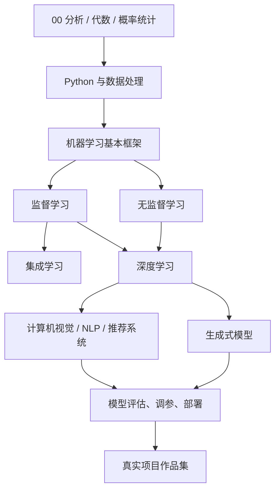
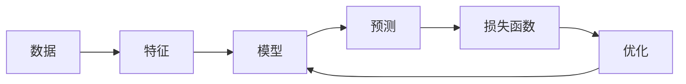

# 机器学习模型学习路线图

这份计划从数学基础和整体框架开始，逐步覆盖机器学习中的主要方法和模型。学习方式建议以“概念理解 + 可视化 + 代码实验 + 小项目”组合推进，而不是只看公式或只跑库函数。

## 1. 总体路线



每个模型都可以用同一套问题来学习：

1. 它解决分类、回归、聚类，还是生成问题？
2. 输入是什么，输出是什么？
3. 模型的核心假设是什么？
4. 损失函数或优化目标是什么？
5. 它如何训练？
6. 如何判断它好不好？
7. 适合什么场景，不适合什么场景？

## 2. 阶段 00：分析、代数与概率统计基础

这一阶段作为独立章节学习，详细内容见：

- [00-math-analysis-algebra-probability-statistics.md](./00-math-analysis-algebra-probability-statistics.md)

目标不是把数学学成纯理论课，而是建立机器学习够用的数学直觉：

- 分析：函数、极限、导数、梯度、优化。
- 代数：向量、矩阵、线性变换、特征值、特征向量。
- 概率：随机变量、概率分布、期望、方差、条件概率。
- 统计：样本、总体、估计、假设检验、最大似然。

建议把这一章作为后续所有模型的“工具箱”。学习线性回归时回看导数和矩阵，学习逻辑回归时回看概率和最大似然，学习 PCA 时回看协方差、特征值和特征向量。

## 3. 阶段 0：Python 与数据处理基础

目标不是先把编程知识全部学完，而是先掌握机器学习实验够用的工具，然后在模型学习中不断回补。

### 要掌握的内容

- Python：变量、函数、类、文件、虚拟环境。
- NumPy：数组、矩阵运算、广播机制。
- Pandas：表格数据清洗、分组、缺失值处理。
- Matplotlib / Seaborn：分布图、散点图、热力图、误差曲线。

### 关键直觉

- 模型就是一个函数。
- 训练就是调整参数。
- 损失函数衡量预测错得多离谱。
- 梯度下降就是沿着“损失下降最快的方向”调整参数。

### 可视化练习

画出一个简单的损失函数曲线，观察参数变化时损失如何变化。

```python
import numpy as np
import matplotlib.pyplot as plt

x = np.linspace(-5, 5, 100)
y = x ** 2

plt.plot(x, y)
plt.title("Loss Surface: y = x^2")
plt.xlabel("parameter")
plt.ylabel("loss")
plt.show()
```

## 4. 阶段 1：机器学习核心框架

先学统一套路，再学具体模型。



### 核心流程

1. 收集数据。
2. 清洗数据。
3. 构造特征。
4. 选择模型。
5. 训练模型。
6. 评估模型。
7. 调参和改进。
8. 部署或用于分析。

### 必须理解的概念

- 训练集、验证集、测试集。
- 过拟合和欠拟合。
- 偏差和方差。
- 特征工程。
- 交叉验证。
- 模型评估指标。

## 5. 阶段 2：监督学习

监督学习是机器学习最重要的基础层。它有明确的输入和标签，目标是学会从输入预测输出。

### 4.1 线性回归

用于预测连续值，例如房价、销量、温度、收入。

学习重点：

- 线性函数。
- 均方误差。
- 最小二乘法。
- 梯度下降。
- 残差分析。

可视化练习：

- 画散点图和拟合直线。
- 画残差分布。
- 画训练过程中的 loss 曲线。

代码项目：

- 用房屋面积预测房价。
- 用广告投入预测销售额。

### 4.2 逻辑回归

用于二分类，例如是否违约、是否点击、是否患病。

学习重点：

- Sigmoid 函数。
- 概率输出。
- 交叉熵损失。
- 决策阈值。
- Precision、Recall、F1、AUC。

可视化练习：

- 画 Sigmoid 曲线。
- 画分类决策边界。
- 画混淆矩阵。
- 画 ROC 曲线。

代码项目：

- 用户是否流失预测。
- 邮件是否垃圾邮件分类。

### 4.3 KNN

通过“离我最近的样本”进行判断，适合理解距离、特征缩放和局部决策。

学习重点：

- 欧氏距离。
- K 值选择。
- 特征标准化。
- 分类边界。

可视化练习：

- 画不同 K 值下的决策边界。
- 比较标准化前后的分类效果。

代码项目：

- 鸢尾花分类。
- 简单手写数字分类。

### 4.4 决策树

像人一样做 if-else 判断，适合可视化和解释。

学习重点：

- 信息增益。
- 基尼系数。
- 树深度。
- 剪枝。
- 可解释性。

可视化练习：

- 画决策树结构。
- 画特征重要性。
- 画不同深度下的训练误差和验证误差。

代码项目：

- 判断用户是否购买。
- 贷款审批分类。

### 4.5 随机森林

由多棵决策树投票或平均得到结果，可以降低单棵树的过拟合风险。

学习重点：

- Bagging。
- 随机采样。
- 多模型投票。
- 特征重要性。

可视化练习：

- 比较单棵树和随机森林的决策边界。
- 画特征重要性柱状图。

代码项目：

- 房价预测。
- 客户流失预测。

### 4.6 GBDT / XGBoost / LightGBM

这是表格数据中非常重要的一类模型，在很多工业场景中仍然很强。

学习重点：

- Boosting。
- 残差拟合。
- 学习率。
- 树数量。
- 最大深度。
- 正则化。

可视化练习：

- 画迭代轮数和验证误差的关系。
- 画特征重要性。
- 画 learning rate 对训练结果的影响。

代码项目：

- 信贷风险预测。
- 点击率预测。
- 销售额预测。

## 6. 阶段 3：无监督学习

无监督学习没有标准答案，重点是发现数据结构。

### 5.1 K-Means

学习重点：

- 聚类中心。
- 样本到中心的距离。
- K 值选择。
- 肘部法则。

可视化练习：

- 画二维聚类结果。
- 画不同 K 值下的聚类效果。
- 画肘部法则曲线。

项目：

- 用户消费分群。
- 商品风格分群。

### 5.2 DBSCAN

学习重点：

- 密度聚类。
- 噪声点。
- eps 和 min_samples。
- 不规则形状簇。

可视化练习：

- 对比 K-Means 和 DBSCAN 在非球形数据上的效果。
- 标出异常点。

项目：

- 异常交易识别。
- 地理位置热点聚类。

### 5.3 PCA

学习重点：

- 降维。
- 方差解释率。
- 主成分。
- 信息压缩。

可视化练习：

- 将高维数据压缩到二维散点图。
- 画累计方差解释率。

项目：

- 高维用户画像可视化。
- 图像压缩入门。

### 5.4 t-SNE / UMAP

学习重点：

- 高维数据可视化。
- 局部结构。
- embedding 分布。

可视化练习：

- 可视化手写数字数据。
- 可视化文本 embedding。

项目：

- 新闻文章聚类可视化。
- 商品 embedding 分布观察。

## 7. 阶段 4：深度学习基础

深度学习的核心是让模型自动学习表示，而不是完全依赖人工设计特征。

### 学习顺序

1. 感知机。
2. 多层神经网络 MLP。
3. 反向传播。
4. 激活函数：ReLU、Sigmoid、Tanh。
5. 优化器：SGD、Adam。
6. 正则化：Dropout、BatchNorm、Weight Decay。

### 必须熟悉的训练代码结构

```python
for epoch in range(num_epochs):
    for x, y in dataloader:
        pred = model(x)
        loss = loss_fn(pred, y)

        optimizer.zero_grad()
        loss.backward()
        optimizer.step()
```

### 可视化练习

- 画神经网络结构图。
- 画 loss 曲线。
- 画 learning rate 曲线。
- 画权重分布。
- 可视化中间层特征。

### 项目

- 用 PyTorch 训练 MNIST 手写数字分类。
- 自己实现一个小型 MLP。
- 对比不同学习率对训练曲线的影响。

## 8. 阶段 5：方向模型

深度学习之后可以按兴趣选择方向。

### 7.1 计算机视觉

模型：

- CNN。
- ResNet。
- YOLO。
- Vision Transformer。

项目：

- 图片分类。
- 目标检测。
- 缺陷检测。
- OCR 入门。

可视化：

- 卷积核。
- 特征图。
- Grad-CAM 热力图。
- 检测框。

### 7.2 自然语言处理

模型：

- Word2Vec。
- RNN / LSTM。
- Transformer。
- BERT。
- GPT 类模型。

项目：

- 文本分类。
- 情感分析。
- 文本相似度。
- 简单问答系统。

可视化：

- 词向量二维投影。
- attention heatmap。
- token 分布。
- embedding 相似度图。

### 7.3 推荐系统

模型：

- 协同过滤。
- 矩阵分解。
- Wide & Deep。
- DeepFM。
- 双塔模型。

项目：

- 电影推荐。
- 商品召回。
- 用户点击率预测。

可视化：

- 用户-物品矩阵。
- embedding 分布。
- 召回和排序流程图。
- 点击率预测特征重要性。

## 9. 阶段 6：生成式模型

生成式模型适合放在深度学习基础之后学习。

### 学习顺序

1. AutoEncoder。
2. VAE。
3. GAN。
4. Diffusion Model。
5. Transformer Decoder。
6. RAG。
7. Agent 基础。

### 要理解的问题

- 生成模型如何表示概率分布？
- embedding 是什么？
- attention 如何工作？
- RAG 为什么能把私有知识接入模型？
- 微调、提示词、检索增强分别适合什么场景？

### 项目

- 手写数字生成。
- 简单图像生成。
- 文档问答 RAG。
- 本地知识库助手。

## 10. 阶段 7：强化学习

强化学习可以后置，不建议太早学。

### 模型顺序

1. 多臂老虎机。
2. Q-Learning。
3. DQN。
4. Policy Gradient。
5. PPO。

### 核心概念

- 状态 state。
- 动作 action。
- 奖励 reward。
- 策略 policy。
- 价值函数 value function。

### 项目

- 走迷宫。
- CartPole。
- 简单游戏 AI。

## 11. 建议学习节奏

如果每周投入 6-10 小时，可以按下面节奏推进。

| 阶段 | 时间 | 重点 |
| --- | ---: | --- |
| 分析 / 代数 / 概率统计 | 2-3 周 | 函数、导数、梯度、矩阵、分布、统计推断 |
| Python + 数据处理 | 2 周 | NumPy、Pandas、可视化 |
| 机器学习框架 | 1 周 | 数据、特征、模型、损失、评估 |
| 监督学习 | 4 周 | 回归、分类、树模型、集成学习 |
| 无监督学习 | 2 周 | 聚类、降维、异常检测 |
| 深度学习基础 | 4 周 | PyTorch、MLP、CNN |
| NLP / CV / 推荐系统选一 | 4-6 周 | 做方向项目 |
| 生成式 AI / RAG | 3-4 周 | 文档问答、embedding、检索 |
| 项目作品集 | 持续 | 3-5 个完整项目 |

## 12. 每个模型的学习模板

每学一个模型，都按下面模板推进：

```text
1. 用一句话解释它解决什么问题。
2. 画出它的工作流程。
3. 用 sklearn 跑通一次。
4. 手写一个极简版本。
5. 可视化它的决策过程。
6. 换一个数据集再跑一次。
7. 写一页总结：适用场景、优点、缺点、关键参数。
```

## 13. 推荐项目组合

建议最后形成 3-5 个完整作品，而不是只保存零散 notebook。

### 入门项目

- 鸢尾花分类。
- 房价预测。
- 用户流失预测。

### 中级项目

- 信贷风险预测。
- 用户分群。
- 商品推荐系统。

### 进阶项目

- 图像分类或目标检测。
- 文本分类或问答系统。
- 本地知识库 RAG。

## 14. 后续完善方向

这份路线图可以继续扩展成几个独立章节：

- `00-math-analysis-algebra-probability-statistics.md`：分析、代数与概率统计基础。
- `01-supervised-learning.md`：监督学习详细计划。
- `02-unsupervised-learning.md`：无监督学习详细计划。
- `03-deep-learning.md`：深度学习详细计划。
- `04-nlp-cv-recommender.md`：方向模型计划。
- `05-generative-ai-rag.md`：生成式 AI 和 RAG 计划。

下一步建议先展开监督学习模块，把线性回归、逻辑回归、KNN、决策树、随机森林、XGBoost 拆成 4 周计划，并为每个模型配套可视化图、代码练习和小项目。
